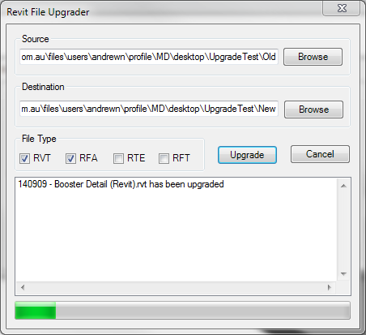

## File Upgrader ##

Updated version of the File Upgrader Plugin by the Autodesk Developer Network.

Updated to:
 - Work with Revit 2017
 - Suppress some dialog errors / warnings.
    
#### Screenshot ####

    
    
Original source can be found here:
http://thebuildingcoder.typepad.com/files/fileupgrader_2015-08-27-1.zip

#### Original release notes ####

~~~~
================================================
      Plugin of the Month, June 2011
Brought to you by the Autodesk Developer Network
================================================
-------------
File Upgrader
-------------

Description
-----------
This plugin can be used to batch upgrade previous versions of Revit 
files to the Revit 2012 format. This utility tool is intended to 
help upgrade family contents. You can also use it to upgrade 
project files.  

System Requirements
-------------------
This plugin has been tested with Revit Architecture 2012 and 
requires the .NET Framework 4.0.

A pre-built version of the plugin has been provided which should
work on 32- and 64-bit Windows systems.
The plugin has not been tested with all Revit verticals, 
but should work (see "Feedback", below, otherwise).

The source code has been provided as a Visual Studio 2010 project
containing C# code (not required to run the plugin).

Installation
------------
The following steps are for using the plugin with Revit 
Architecture 2012. 
If you are using Revit MEP and Structure 2012, please consider 
the product name accordingly in the paths listed below.  

1. If you are using Vista or Windows 7, then first check
if the zip file needs to be unblocked.
Right-click on the zip file and select "Properties". If you see
an "Unblock" button, then click it. 

2. Copy the plugin module "ADNPlugin-FileUpgrader.dll" to 
a location on your local system (For example, your Revit-based 
application's root program folder).

3. Open the .addin manifest file, "ADNPlugin-FileUpgrader.addin" 
in Notepad.

Modify the following line to match to the location of the plugin
module that you have just copied if it is different: 

<Assembly>C:\Program Files\Autodesk\Revit Architecture 2012\
Program\ADNPlugin-FileUpgrader.dll</Assembly>
 
Save and close the file. 

4. Copy the above .addin file you just modified to one of the 
following locations: 

For Windows XP: 

C:\Documents and Settings\All Users\Application Data\
Autodesk\Revit\Addins\2012\

or 

C:\Documents and Settings\<your login>\Application Data\
Autodesk\Revit\Addins\2012\

(The first location will make the plugin available to all users of
your computer, while the second is for your use only.)

For Vista/Windows 7:

C:\ProgramData\Autodesk\Revit\Addins\2012\

or 

C:\Users\<your login>\AppData\Roaming\Autodesk\Revit\Addins\2012\

(The first location will make the plugin available to all users 
of your computer, while the second is for your use only.) 

5. Once installed, "File Upgrader" command becomes available 
in your Revit application.  Go to "Add-ins" tab >> "External Tools"
panel.  You should see the "File Upgrader" command listed there. 

Usage
-----
Inside your Revit-based application, go to "Add-ins" tab >> 
"External Tools" panel >> "File Upgrader" to start the command. 
"Revit File Upgrader" dialog appears.  

Under the "Source" text box, specify the location of the folder 
where previous versions of Revit files resides. Similarly, in the 
"Destination" box, specify the folder where the upgraded filers 
will be saved. 
Check the file types you would like to upgrade; you can upgrade
.rvt, .rfa, and .rte files. By default, .rvt and .rfa are checked.
Press the "Upgrade" button to start the upgrade. 

Once upgrade starts, Revit will open a file one by one, and save
in the destination folder. The progress can be monitored in the 
list box at the lower part of the dialog. 

After the upgrade process is completed, a dialog box
is displayed with the total count of succeeded files over total
number of files confirming the completion of upgrade. The status
messages are also save as a log file, UpgraderLog.txt, in the 
destination folder. 
(For some reason, if the files fail the automatic upgrade process, 
the users can check the log file, and manually open the files and 
save them to the current version after resolving the 
conflicts/errors using the Revit user interface.) 

The tool handles nested folders. It also handles catalog files 
(.txt files) if it exists, copying them to the destination 
folder. 

Uninstallation
--------------
Simply removing "ADNPlugin-FileUpgrader.addin" file from 
your installation folder will uninstall the plugin. 

Known Issues
------------
1) This plug-in only works when there is an active document in Revit
2) After running the plug-in, the last document remains open in the 
Revit's User Interface. The file is saved, but the user will have 
to manually close it.  
These are due to the current limitation of API. We hope to address 
it in future. 

Author
------
This plugin was written by Saikat Bhattacharya of the Autodesk
Developer Technical Services team. 

Acknowledgements
----------------

Further Reading
---------------
For more information on developing with Revit, please visit the
Revit Developer Center at http://www.autodesk.com/developrevit

Feedback
--------
Email us at labs.plugins@autodesk.com with feedback or requests for
enhancements.

Release History
---------------

1.0    Original release
2.0    Bug Fixes (5th July 2011)

(C) Copyright 2011 by Autodesk, Inc. 

Permission to use, copy, modify, and distribute this software in
object code form for any purpose and without fee is hereby granted, 
provided that the above copyright notice appears in all copies and 
that both that copyright notice and the limited warranty and
restricted rights notice below appear in all supporting 
documentation.

AUTODESK PROVIDES THIS PROGRAM "AS IS" AND WITH ALL FAULTS. 
AUTODESK SPECIFICALLY DISCLAIMS ANY IMPLIED WARRANTY OF
MERCHANTABILITY OR FITNESS FOR A PARTICULAR USE.  AUTODESK, INC. 
DOES NOT WARRANT THAT THE OPERATION OF THE PROGRAM WILL BE
UNINTERRUPTED OR ERROR FREE.
~~~~